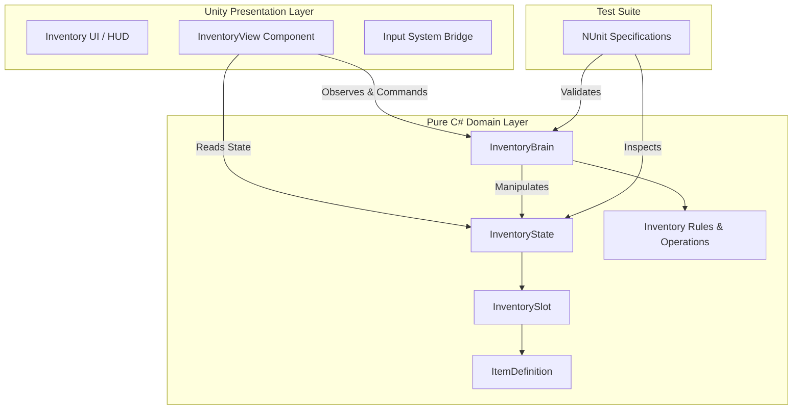

# Advanced Inventory & Crafting System

[](https://unity.com/)
[](https://github.com/)
[](https://github.com/)
[](https://github.com/)

A modular, extensible **Inventory and Crafting System** built for Unity using **Clean Architecture**, **Specification-Driven Development (SDD)**, and **Test-Driven Development (TDD)**.

---

## 🎯 Portfolio Highlights & Design Pillars

This project serves as a reference implementation of enterprise-grade software engineering practices inside Unity game development:

1. **Clean Architecture & Assembly Decoupling:**
   - **`MyGame.Core` (Pure C#):** The domain and business logic have **zero dependencies** on `UnityEngine`, `MonoBehaviour`, or `ScriptableObject`. Business logic runs anywhere (.NET CLI, Unity, Cloud backends) without engine overhead.
   - **`MyGame.Core.Specs` (NUnit Tests):** Pure domain unit test suite designed for sub-second test execution.
   - **`MyGame.UnityView` (Presentation & Bridge):** Unity-specific view layer handling `MonoBehaviour` bindings, UI Toolkit / Canvas rendering, audio, and the New Input System. Reads state from Core while Core remains 100% unaware of Unity.

2. **Brain / State Pattern:**
   - **State (`InventoryState`):** Anemic data structures holding state (slots, capacity, item instances). Serializable and snapshot-friendly for save/load or networking.
   - **Brain (`InventoryBrain`):** Central controller and execution engine that applies domain rules, validates constraints, and mutates state deterministically.
   - **Rule-Based Modularity:** Extensible via composition and rule interfaces (e.g., `IInventoryRule`), adhering strictly to the Open/Closed Principle.

3. **Specification-Driven Development (SDD) & TDD:**
   - Features are first specified using **Gherkin syntax (Given-When-Then)** before code is written.
   - Tests are authored in the **Red Phase** against Gherkin criteria before implementing minimal passing code (**Green Phase**), followed by refactoring.

4. **Automated CI/CD with GitHub Actions:**
   - Automated workflows run unit tests and code analysis on pull requests to ensure regressions are caught instantly.

---

## 📐 Architecture Overview



---

## 📜 Feature Specifications (Gherkin / SDD)

### Feature: Item Stacking Limits

```gherkin
Feature: Item Stacking Limits
  Scenario: Attempting to stack items beyond the maximum limit
    Given the Player has a slot with 98 "Health Potion"
    And the stack limit for potions per slot is 100
    When the player attempts to add 5 "Health Potion" to this inventory
    Then the current slot should contain 100 potions
    And the inventory should create a new slot containing 2 potions
    But if there are no empty slots, the system should return an "Inventory Full" error and reject the remaining 2 potions.
```

---

## 📁 Assembly Structure

| Assembly / Directory | Namespace | Dependencies | Purpose |
|---|---|---|---|
| `Assets/Scripts/Core` | `MyGame.Core` | Pure .NET (`System`, `System.Collections.Generic`, `LINQ`) | Domain logic, rules, brain controller, and state |
| `Assets/Scripts/Specs` | `MyGame.Core.Specs` | `MyGame.Core`, `nunit.framework` | Fast unit test specifications matching Gherkin scenarios |
| `Assets/Scripts/UnityView` | `MyGame.UnityView` | `MyGame.Core`, `UnityEngine`, UI Packages | Unity MonoBehaviours, View models, UI binders, audio, visual fx |

---

## 🔄 Development Workflow (SDD + TDD)

1. **Specify:** Define domain behavior in Gherkin scenarios (Given-When-Then).
2. **Red Phase:** Write NUnit tests asserting the scenario specifications (fails with `NotImplementedException` or assertion error).
3. **Green Phase:** Write the minimum necessary domain logic in `MyGame.Core` to pass tests.
4. **Refactor:** Clean code, optimize data structures, enforce SOLID principles.
5. **View Integration:** Wire up Unity UI Toolkit / MonoBehaviours to listen to state events.
6. **Continuous Integration:** Run automated test runners on GitHub Actions.
