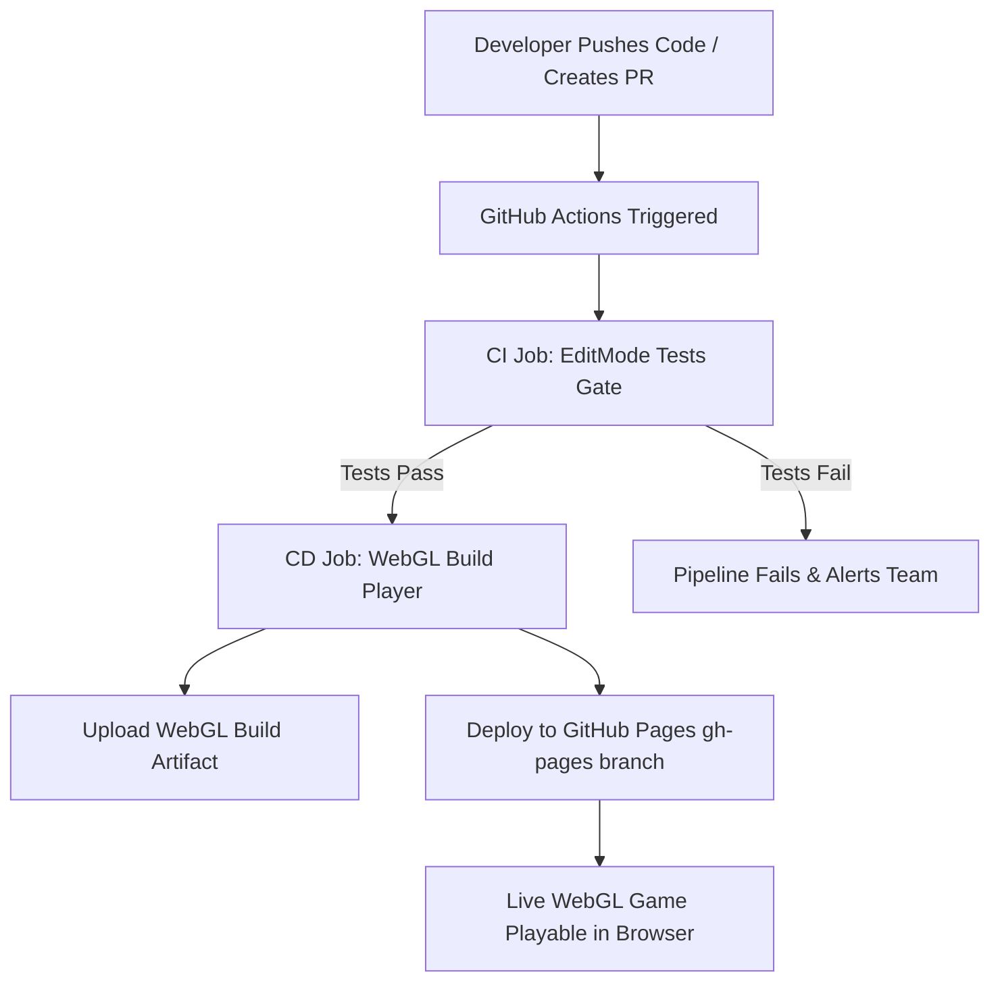

# Complete Unity CI/CD Setup Guide: Automated Testing & WebGL Deployment with GameCI

This guide documents the enterprise-grade Continuous Integration and Continuous Deployment (CI/CD) pipeline implemented for this project using **GitHub Actions** and **[GameCI](https://game.ci/)**.

---

## 📖 What is CI/CD for Game Development?

- **Continuous Integration (CI):** Every commit or pull request automatically triggers headless test runners to validate code integrity, compile assemblies, and execute unit tests (e.g., SDD/TDD specifications) before code reaches production branches.
- **Continuous Deployment (CD):** Once all tests pass on the `main` branch, the pipeline automatically compiles the Unity project into a target platform player (e.g., WebGL) and publishes the build directly to **GitHub Pages** without any manual developer intervention.
- **GameCI:** The official open-source CI/CD toolkit that packages Unity Editor environments into optimized Docker containers for GitHub Actions runners.



---

## 🔑 Step 1: Acquiring & Configuring the Unity License

To run Unity headlessly inside GitHub Actions Docker containers, an activated Unity License is required.

### 1.1 Generating the `.alf` (Activation License File)
1. In a fresh repository, an activation workflow or GameCI runner attempts to launch Unity, generating an activation request file (`.alf`).
2. Alternatively, you can use the official [GameCI Activation Workflow](https://game.ci/docs/github/activation).

### 1.2 Activating on the Unity License Portal
1. Download the generated `.alf` file.
2. Navigate to the [Unity Manual Activation Portal](https://license.unity3d.com/manual).
3. Upload the `.alf` file and select your **Unity Personal** or **Unity Pro/Plus** license tier.
4. Download the resulting `.ulf` (Unity License File).

### 1.3 Storing Secrets in GitHub
1. Open your repository on GitHub and navigate to:  
   `Settings` $\rightarrow$ `Secrets and variables` $\rightarrow$ `Actions` $\rightarrow$ `New repository secret`.
2. Add the following secrets:

| Secret Name | Description | Example / Format |
|---|---|---|
| `UNITY_LICENSE` | The complete XML text contents of your downloaded `.ulf` file | `<?xml version="1.0" encoding="UTF-8"?>...` |
| `UNITY_EMAIL` | The email address associated with your Unity ID | `developer@example.com` |
| `UNITY_PASSWORD` | The password for your Unity account | `********` |

---

## 🧪 Step 2: Automated Testing Workflow (CI)

The CI workflow is defined in [`.github/workflows/unity-tests.yml`](../.github/workflows/unity-tests.yml).

### Key Features:
- **Triggers:** Runs automatically on every `push` and `pull_request` against `main`, `master`, and `develop`.
- **Git LFS:** Checks out the repository with `lfs: true` to support versioned binary assets.
- **Library Caching:** Uses `actions/cache@v4` to cache the Unity `Library/` directory based on the hash of `Assets/`, `Packages/`, and `ProjectSettings/`. This reduces runner startup times from 15+ minutes to under 3 minutes.
- **EditMode Test Runner:** Uses `game-ci/unity-test-runner@v4` to execute all NUnit test specifications (`MyGame.Core.Specs`).
- **Artifact Preservation:** Exports NUnit XML test results and editor logs using `actions/upload-artifact@v4`.

```yaml
- name: Run EditMode Tests
  uses: game-ci/unity-test-runner@v4
  env:
    UNITY_LICENSE: ${{ secrets.UNITY_LICENSE }}
    UNITY_EMAIL: ${{ secrets.UNITY_EMAIL }}
    UNITY_PASSWORD: ${{ secrets.UNITY_PASSWORD }}
  with:
    testMode: EditMode
    artifactsPath: artifacts
    githubToken: ${{ secrets.GITHUB_TOKEN }}
    checkName: Unity EditMode Test Results
```

---

## 🚀 Step 3: WebGL Build & Continuous Deployment (CD)

The CD workflow is defined in [`.github/workflows/unity-build.yml`](../.github/workflows/unity-build.yml).

### Key Features:
- **Gated Execution (`needs: test`):** The build job will **never** execute if unit tests fail.
- **GameCI Unity Builder:** Uses `game-ci/unity-builder@v4` with `targetPlatform: WebGL` to produce an optimized web build.
- **Artifact Upload:** Stores a downloadable zip of the WebGL build (`WebGL-Build`).
- **GitHub Pages Deployment:** Uses `peaceiris/actions-gh-pages@v4` to deploy the exact WebGL output folder (`build/WebGL/WebGL`) to the `gh-pages` branch.

```yaml
# Deploy WebGL to GitHub Pages (only on main or master)
- name: Deploy WebGL to GitHub Pages
  uses: peaceiris/actions-gh-pages@v4
  if: github.ref == 'refs/heads/main' || github.ref == 'refs/heads/master'
  with:
    github_token: ${{ secrets.GITHUB_TOKEN }}
    publish_dir: ./build/WebGL/WebGL
```

---

## ⚙️ Step 4: Configuring GitHub Repository Settings

To allow the automated workflows to push to the `gh-pages` branch and serve the live site:

### 4.1 Enable Workflow Permissions
1. Navigate to: `Settings` $\rightarrow$ `Actions` $\rightarrow$ `General`.
2. Scroll to **Workflow permissions**.
3. Select **Read and write permissions**.
4. Check **Allow GitHub Actions to create and approve pull requests**.
5. Click **Save**.

### 4.2 Configure GitHub Pages Source
1. Navigate to: `Settings` $\rightarrow$ `Pages`.
2. Under **Build and deployment > Source**, select **Deploy from a branch**.
3. Under **Branch**, select `gh-pages` and folder `/ (root)`.
4. Click **Save**.

Your WebGL build will now be automatically updated and accessible at:  
`https://<YOUR_GITHUB_USERNAME>.github.io/<YOUR_REPO_NAME>/`

---

## 🛠️ Troubleshooting & Common Pitfalls

### 1. 404 Error on GitHub Pages (`index.html` not found)
- **Cause:** By default, GameCI `unity-builder` places WebGL output inside `build/WebGL/<buildName>` (typically `build/WebGL/WebGL`). If `publish_dir` is configured as `./build/WebGL`, `index.html` ends up inside a subfolder rather than the branch root.
- **Fix:** Set `publish_dir: ./build/WebGL/WebGL` in the deployment step.

### 2. "Unable to parse file / An error occurred running the Unity content" on WebGL load
- **Cause:** WebGL builds often use Brotli or Gzip compression by default. If the static web server (GitHub Pages) is not configured with matching `Content-Encoding` response headers, the browser will fail to decompress the files.
- **Fix in Unity Editor:**
  1. Go to `Edit` $\rightarrow$ `Project Settings` $\rightarrow$ `Player` $\rightarrow$ `WebGL Tab`.
  2. Expand `Publishing Settings`.
  3. Set **Compression Format** to `Disabled` (or check **Decompression Fallback**).

### 3. Unity License Machine ID Mismatch
- **Cause:** GitHub Actions uses ephemeral runners with changing MAC addresses / container IDs.
- **Fix:** Ensure you are using the manual activation method (`.alf` $\rightarrow$ `.ulf` through https://license.unity3d.com) or configure a floating seat / professional serial token (`UNITY_SERIAL`).

